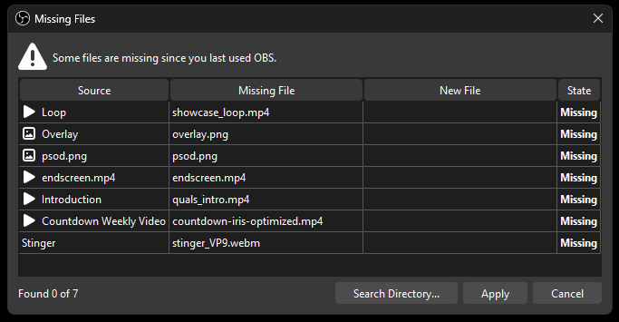
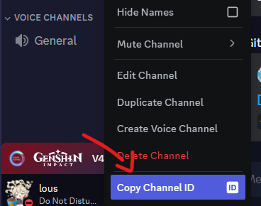
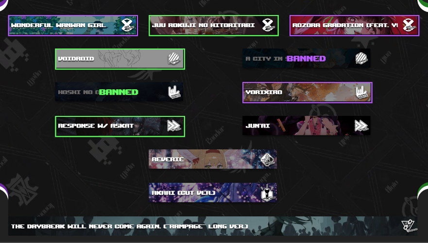
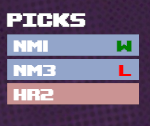
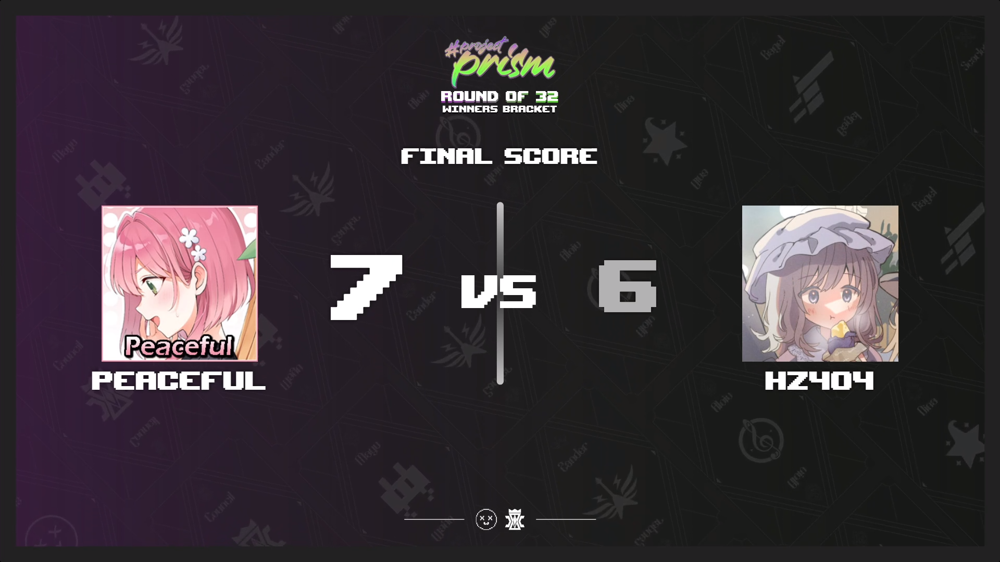
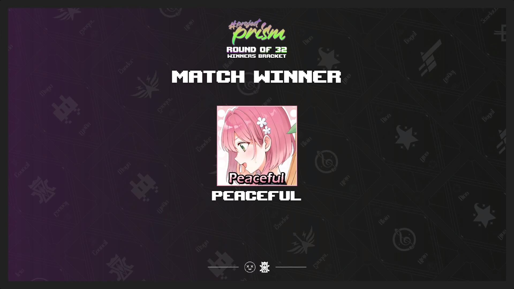

# projectprism-streamOverlay

The main repository for the overlay of Project Prism, meant to run on tosu
___

## Setup

If you have any questions after reading all of the below, do not hesitate to contact me for clarification! The following is required to successfully run this project:
- OBS
- Tosu/Gosumemory (if warranted)
- osu! stable/cutting Edge client and osu! tournament client

### OBS Scene
The scene file is located in `projectprism-streamOverlay/_data/`. The JSON file will be named **projectprism_vX.X** in the directory.

After importing the scene file, you should be prompted with a Missing Files tab.


Click on "Search Directory..." and select the `_shared_assets` folder in the project files. If it doesn't fully link all the missing files, try selecting the subfolders in the `_shared_assets` folder. After that, just click on Apply and the assets should be displayed.

### Tosu & Stream Directory
**[Project link for tosu](https://github.com/KotRikD/tosu#readme)**

To install the application, just download the latest release and export `tosu.exe` in whatever directory you want. Then in that same directory, create a static file and run `tosu.exe`.

To properly import all overlays, download the latest release of this project and import it into the static folder. If you have an osu! client open, the OBS scenes should properly reflect the scenes. If there's any issue projecting the overlay on OBS, you can try finding the URL link of the individual overlays by scrolling down to the target overlay and clicking on the URL parameter.

If you open the link in the browser and it doesn't project anything, contact louscmh immediately. If not, then OBS should be able to project the browser source.

### Setting up `beatmaps.json`
The JSON file contains 4 variables:
- `beatmapId`: the id of your beatmap, as displayed in the URL of the beatmap link (beatmapsets/2019194#taiko/***4204844***)
- `pick`: the pick name of your beatmap (NM1, HR2, TB, etc.). This overlay supports the following mods: NM, HD, HR, DT, FM, FL, TB
- `modSR`: the star rating value of DT maps, inputted manually (float)
- `mapper`: custom string used if you want to list down more than 1 mapper

***(NOTE FOR CUSTOM MAPS)*** As unreleased maps have no beatmapId, the beatmapId will be substituted with the map's file name instead. Replace the `beatmapId` parameter with a string following this format: `Arist - Song Title (Mapper Name) [Difficulty].osu`

- `Artist`: The **ROMANIZED** name of the Artist of the song (ex: `Null Specification`)
- `Song Title`: The **ROMANIZED** name of the song (ex: `Aletheia (fake love, fake summer)`)
- `Mapper Name`: The name of the mapper associated with the beatmap (ex: `Rinze`)
- `Difficulty`: The difficulty name of the beatmap (ex: `fake promise`)

Combining all examples of the arguments, you will get `Null Specification - Aletheia (fake lover, fake summer) (Rinze) [fake promise].osu`. The string is **Case** and **Space** sensitive.

This must be updated **every week** to reflect the changes in-stream and must be distributed to the person streaming the showcase overlay.

A sample example of the JSON is included as follows:

```json
[
    { "beatmapId": 4067283, "pick": "NM1", "modSR":5.64, "mappers":""},
    { "beatmapId": 4069079, "pick": "NM2", "modSR":5.12, "mappers":""},
    { "beatmapId": 4069278, "pick": "NM3", "modSR":5.92, "mappers":""},
    { "beatmapId": 4069245, "pick": "HD1", "modSR":4.49, "mappers":""},
    { "beatmapId": 4082666, "pick": "HD2", "modSR":4.02, "mappers":""},
    { "beatmapId": "takehirotei as Infinite Limit - I.R.I.S (Jerry) [Trials of IRIS].osu", "pick": "HR1", "modSR":4.91, "mappers":""},
    { "beatmapId": "Null Specification - Aletheia (fake lover, fake summer) (Rinze) [fake promise].osu", "pick": "HR2", "modSR":4.72, "mappers":""},
    { "beatmapId": 4069232, "pick": "DT1", "modSR":5.62, "mappers":""},
    { "beatmapId": 2590170, "pick": "DT2", "modSR":6.67, "mappers":""},
    { "beatmapId": 4069219, "pick": "FM1", "modSR":4.7, "mappers":"me, my mother, and your dad"}
]
```

### Commentator Overlay
In numerous scenes, there will be an overlay for the commentators in their own scene respectively. Click on the commentator overlay, and add both the server id that contains the voice channel you are in, and the voice channel id that you are streaming in into the URL. (This requires you to turn on Developer Mode in Discord!)




If you don't plan to talk at all, you can do this to hide yourself in vc indicator:
1. Right click on yourself in discord, Copy ID.
2. Put your ID into the following code: `li[data-userid*="your user id here"] {display: none;}`
3. Paste this code at the end of the respective commentator overlay's custom CSS.

### Mappool Overlay
Example scene for reference


**IMPORTANT SETUP STEP**
The showcase overlay uses the following JSON to function:
- `beatmaps.json`
- `api.json`
- `seeds.json`

For the mappool overlay to properly function & display both player & beatmap details, it will require you to insert an API key into `_data/api.json`.

You can find your own osu! API at old.ppy.sh/p/api (wait for awhile after logging in!), make sure to not reveal this api key to anyone else (otherwise they will have the potential to steal your credentials)

Within the Mappool Overlay there are a few interactable elemenets that requires the streamer to manually click on them to properly display what is being picked, who is it being picked by, moving on to the next map etc. To interact with the Overlay, click on the `Interact` Button when selecting the Mappool Overlay in OBS.


For convenience for reading chat to see who is picking/banning first and what is being picked/banned, a chat frame is included below the viewable overlay (Viewable when clicking on the interact button)

**INTERACTING WITH THE BEATMAPS**



- Left Click to pick for **Player 1**
- Right Click to pick for **Player 2**
- Shift + Left Click to ban for **Player 1**
- Shift + Right Click to ban for **Player 2**
- Ctrl + Left Click to retract any actions (This will call back the pick in the player column aswell)

**INTERACTING WITH MAPPICKS**



- Left Click to set the pick as a **WIN**
- Right Click to set the pick as a **LOSS**
- Ctrl + Left Click to retract any actions

Under normal circumstances, this will be updated automatically upon reaching tbe result screen of each pick. But should the unique situation occur where this doesn't happen, you can adjust it by yourself by doing the above.

**INTERACTING WITH THE CONTROL PANEL**


- **BAN PHASE**: Switches phase back to banning on the screen (This is the default phase upon initializing)
- **PICK PHASE**: Switches phase to picking on the screen (Will automatically switch after both bans)
- **TOGGLE LEFT PLAYER**: Toggle current player to **Player 1**
- **TOGGLE RIGHT PLAYER**: Toggle current player to **Player 2**
- **NEXT PICK**: Swithces current player to the next player. If map screen is moved to the center it will return to picking position. This will be activated automatically upon reaching the result screen of the map.

### Match Overlay
Example scene for reference


The match overlay uses the following JSON to function:
- `beatmaps.json`
- `api.json`
- `seeds.json`

### Mappool Showcase
Example scene for reference


The showcase overlay uses the following JSON to function:
- `beatmaps.json`

### Winner Overlay
The winner overlay uses the following JSON to function:
- `seeds.json`

Example scene for reference



When a player has won the match by reaching the number of points required to win, the scene will switch to the 2nd screenshot above, and the button to switch back to the 1st screenshot will appear in OBS. Just click on the `Interact` button when selecting the `Winner Overlay` asset and click on the button to the right of the prompted window.

### Player Intro Overlay
The player intro overlay uses the following JSON to function:
- `seeds.json`
- `schedule.json`

Example scene for reference


___
## To-do List

### Drafting
- [X] Draft Layout of Match Scene
- [X] Draft Layout of Mappool Scene
- [X] Draft Layout of Showcase Scene
- [X] Draft Layout of Winner Scene
- [X] Draft Layout of Schedule Scene
- [X] Draft Layout of Player Intro Scene
### Implementation (Design + Functionality)
- [X] Implementation of Match Scene
- [X] Implementation of Mappool Scene
- [x] Implementation of Showcase Scene
- [X] Implementation of Winner Scene
- [X] Implementation of Schedule Scene
- [ ] Implementation of Player Intro Scene

## Scene Features

### Match
- Live display of BG, SR, OD, BPM, Length, adjusted to the map's mods
- Player's pick
- Mappick
- Player's match point
- Player's PFP
- Player's Seed
- Scorebar, Scorevalue & Score difference meter
- Chat
- Commentator Section
- Stage Indicator

### Mappool
- Live display of SR, OD, BPM, Length, adjusted to the map's mods
- Player's pick
- Mappick
- Player's match point
- Player's PFP
- Player's Seed
- Chat
- Maps, grouped by their mods (mod icon, song title, difficulty & mapper displayed)
- Commentator Section
- Stage Indicator

### Showcase
- Live display of BG, SR, OD, BPM, Length, adjusted to the map's mods
- Map progress bar
- Mappick
- Commentator Section
- Stage Indicator

### Winner
- Display of the final score point between both players w/ their pfp & name

### Schedule
- Displays upcoming matches from system time, indicated by the player's pfp & their names

### Player Intro
- Name
- PFP
- Seed
- Rank
- Topplays (TENTATIVE)
- Past Match Result (VERY TENTATIVE)